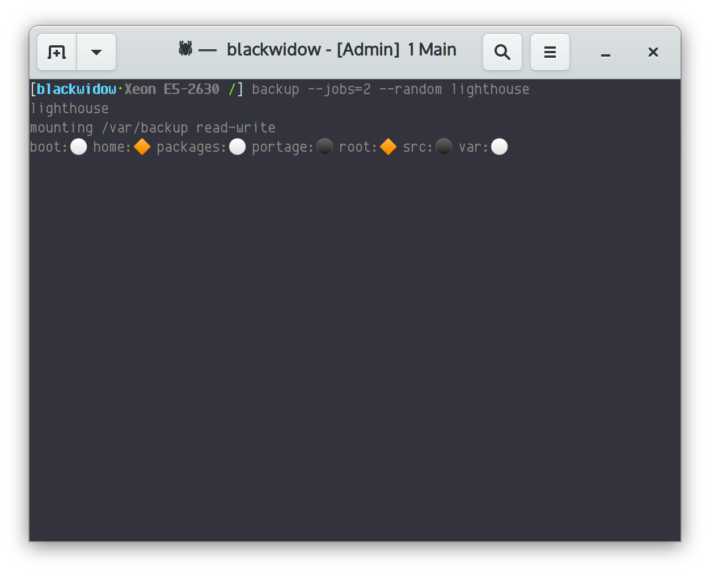

# My backup script

This is the Linux backup script that I wrote and started using after I stopped
using [Amanda](https://github.com/zmanda/amanda).  It uses
[ssh](https://www.openssh.com/) and [rsync](https://rsync.samba.org/) to back
up multiple computers and can back up multiple filesystems in parallel. It
utilizes rsync's `--link-dest` to make efficient, fast backups. The target
backup is a regular filesystem so no special tools or commands are necessary to
restore files.  Recently added were the capability to call "hooks" before and
after a backup operation is performed.

In addition to the `backup` tool there is a `purgebackups` tool that removes
old backups using an algorithm I borrowed from somewhere but was so long ago
that I can't remember.

